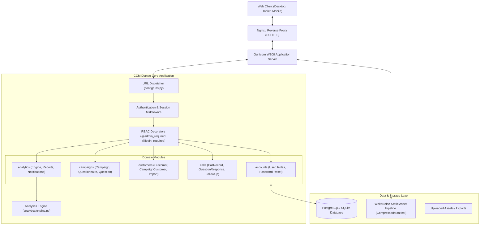
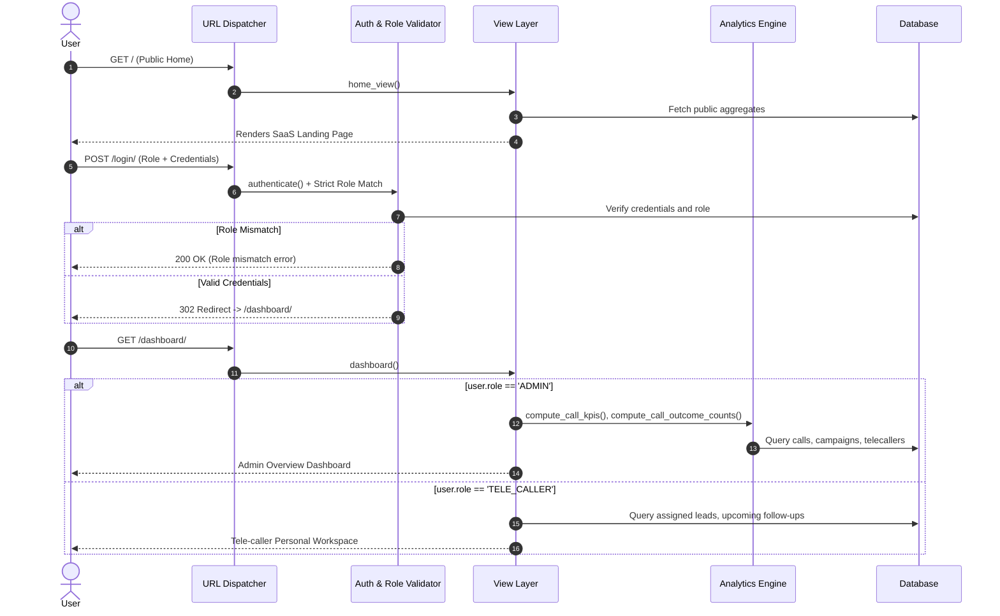

# CCM — System Architecture Documentation

## 1. Overview & Architectural Principles

**CCM (Campaign Call Manager)** is a centralized SaaS platform built on **Django** (Python 3.12) designed for managing tele-calling campaigns, customer engagement, dynamic questionnaires, and real-time operational reporting.

The application follows clean architectural boundaries:
- **Separation of Concerns**: Modular Django applications partitioned by domain: `accounts`, `campaigns`, `customers`, `calls`, and `analytics`.
- **Single Source of Truth**: All operational metrics, completion rates, outcome counts, and performance rankings are computed by a centralized analytics engine (`analytics/engine.py`), preventing discrepancies across views and exports.
- **Strict Server-Side RBAC**: Role restrictions and object-level ownership checks are enforced at the view and database query level, never relying solely on UI visibility.

---

## 2. High-Level System Architecture Diagram

---

## 3. Django Applications & Responsibilities

| Application | Core Models | Primary Responsibilities |
| :--- | :--- | :--- |
| `accounts` | `User` | Custom user model inheriting from `AbstractUser`; role management (`ADMIN`, `TELE_CALLER`); role-aware login with server-side validation; cryptographic password reset workflows; tele-caller self-registration (`/register/`) with strict role-pinning and account provisioning; role-based Help Center & FAQ knowledge base (`accounts/faq_data.py`). |
| `campaigns` | `Campaign`, `Questionnaire`, `Question` | Campaign lifecycle management (Draft, Active, Paused, Completed, Archived); dynamic questionnaire builder supporting 5 question types. |
| `customers` | `Customer`, `CampaignCustomer` | Central customer directory; omnichannel contacts (phone, WhatsApp number, persistent profile notes); historical data protection with archiving lifecycle (`is_active`) and one-click restore; lead enrollment into campaigns; customer workload shifting (`/customers/shift/`); CSV/XLSX bulk lead import with row-level validation; assignment of leads to tele-callers. |
| `calls` | `CallRecord`, `QuestionResponse`, `FollowUp` | Live tele-caller dialing console; call status capture; question response recording; callback/follow-up scheduling and overdue detection; 70% campaign milestone detection; follow-up notification auto-clearing; inactive tele-caller alerts. |
| `analytics` | `Notification` | Centralized analytics engine (`analytics/engine.py`) calculating core KPIs (Total Calls, Completed Calls, Conversion Rate, Avg Call Duration); date-range and campaign filtering; Report Center with PDF (`ReportLab`) and Excel (`openpyxl`) export engines; notification center. |

---

## 4. End-to-End Request & User Workflow

---

## 5. Frontend & UI Architecture

1. **Design Tokens (`static/css/main.css`)**:
   - Central CSS custom property palette defining semantic colors (`--primary`, `--success`, `--warning`, `--danger`, `--bg-primary`, `--bg-secondary`, `--text-main`, `--text-muted`).
   - Standardized spacing, border radii, and box shadows.
2. **Light / Dark Mode**:
   - Implemented via `[data-theme="light"]` and `[data-theme="dark"]` CSS attributes.
   - Synchronized across the entire application and persisted in browser `localStorage` (`ccm_theme`).
3. **Responsive Grid Framework**:
   - Dedicated layout utilities: `.responsive-grid-1-1`, `.responsive-grid-2-1`, `.responsive-grid-1-1-1`, `.responsive-grid-4`.
   - Automatic single-column collapsing on tablet and mobile viewports (`≤768px`).
4. **Mobile Navigation**:
   - Desktop: Persistent, fixed-width sidebar with active state tracking.
   - Mobile (`≤768px`): Off-canvas navigation drawer triggered via hamburger button with background backdrop and outside-click dismissal.
