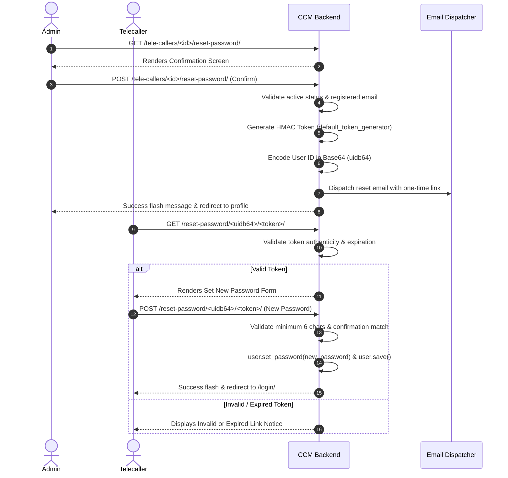

# CCM — Authentication & Password Security Documentation

This document explains the authentication workflow, role-selection step, strict server-side validation, password hashing, and cryptographic password reset architecture in **CCM (Campaign Call Manager)**.

---

## 1. Authentication Flow Overview

CCM uses a two-phase authentication process designed to eliminate confusion between administrative and operational personnel:

```text
Public Landing Page (/)
       │
       ▼
Role Selection Step (/login/)
  [ Administrator ]      [ Tele-caller ]
       │                        │
       ▼                        ▼
Administrator Login       Tele-caller Login
  - Username or Email      - Username or Email
  - Password               - Password
  - Remember Me            - Remember Me
  - Change Role            - Change Role
       │                        │
       └───────────┬────────────┘
                   ▼
       Server-Side Role Matching
         Valid? ──Yes──► Role Dashboard
           │
           No
           ▼
  "The selected role does not match this account."
```

---

## 2. Interactive Role Selection Step

When an unauthenticated user navigates to `/login/`:
1. They are presented with a role prompt: **"Who are you? Choose your role to access your dedicated workspace"**.
2. Two interactive cards are provided:
   - **Administrator**: Management of campaigns, customers, tele-callers, analytics, and reports.
   - **Tele-caller**: Access to assigned leads, live calling console, response logging, and follow-ups.
3. Clicking a role reveals the appropriate login card with tailored heading, badge, and a **"Change Role"** button to toggle back if needed.
4. If a query parameter is passed (e.g., `/login/?role=ADMIN` or `/login/?role=TELE_CALLER`), the view automatically preselects the requested role.

---

## 3. Strict Server-Side Role-Credential Matching

Role validation is **strictly enforced on the backend** in [`accounts.views.login_view`](file:///f:/CCM/accounts/views.py#L55-L125). Frontend form inputs or JavaScript overrides cannot bypass this check.

### Validation Matrix:

| Selected Role | Authenticated Account Role | Outcome | Server Response |
| :--- | :--- | :---: | :--- |
| **Administrator** | `ADMIN` | ✅ **Success** | Redirects to `/dashboard/` (Admin Overview) |
| **Administrator** | `TELE_CALLER` | ❌ **Rejected** | *"The selected role does not match this account. Please select the correct role."* |
| **Tele-caller** | `TELE_CALLER` | ✅ **Success** | Redirects to `/dashboard/` (Tele-caller Workspace) |
| **Tele-caller** | `ADMIN` | ❌ **Rejected** | *"The selected role does not match this account. Please select the correct role."* |
| *None specified* | *Any valid account* | ✅ **Success** | Redirects to appropriate role dashboard |

---

## 4. Deactivated Account Handling

When an account is marked `is_active=False` in the database:
- Login is **immediately blocked**.
- If correct credentials are provided, the user receives an explicit notice:
  > *"Your account has been deactivated. Please contact an administrator."*
- Deactivated accounts cannot be authenticated, nor can their passwords be reset via email until an administrator reactivates the account.

---

## 5. Password Security & Storage

- **PBKDF2 Password Hashing**: Passwords are never stored in plain text. Django hashes all passwords using `PBKDF2SHA256` with 870,000 iterations and salt.
- **No Passwords Exposed in Profile Editing**: The admin edit form for tele-callers ([`templates/telecallers/form.html`](file:///f:/CCM/templates/telecallers/form.html)) contains only profile fields (name, email, phone, active status). Password inputs have been completely removed from edit mode to prevent accidental overwrites or shoulder-surfing.

---

## 6. Cryptographic Password Reset Architecture

Instead of allowing direct password overwrites in the admin UI, CCM implements a production-grade password recovery pipeline:



### Key Security Features of Reset:
1. **One-Time Use**: Tokens become invalid as soon as the password is changed because the token hash includes the user's password hash timestamp.
2. **Time-Limited**: Tokens automatically expire after Django's `PASSWORD_RESET_TIMEOUT` (default: 3 days).
3. **No Credential Exposure**: Administrators never see the new password chosen by the user.

---

## 7. Tele-caller Self-Registration (`/register/`)

CCM provides a secure, streamlined self-registration portal for prospective tele-callers:

1. **Strict Role Pinning**:
   - The registration view ([`accounts/views.py`](file:///f:/CCM/accounts/views.py)) hardcodes `role='TELE_CALLER'` in the `User.objects.create_user()` call.
   - Attackers cannot pass `role=ADMIN` or manipulate POST bodies to achieve privilege escalation.
2. **Server-Side Validation**:
   - **Username**: Must follow `^[a-zA-Z0-9_.]+$` and be unique across the system.
   - **Full Name**: First name and last name are strictly required.
   - **Email**: Must be a valid email format and globally unique.
   - **Password Security**: Minimum 6 characters with mandatory confirmation match.
   - **Terms Agreement**: Form submission requires explicit terms of service acceptance.
3. **Immediate Provisioning & Notification**:
   - Registered users are instantly authenticated via `login(request, user)` and redirected to their personal `/dashboard/` queue.
   - An in-app `Welcome to CCM!` notification is created for the new agent.
   - An alert notification is dispatched to all active administrators notifying them of the new registration.

