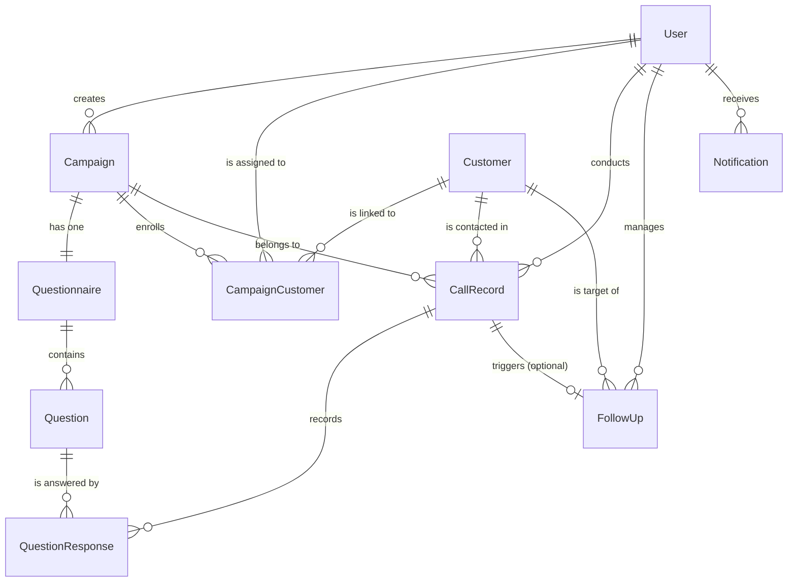

# CCM — Database Architecture & Data Models

This document details the actual database models, fields, foreign keys, constraints, and relationships implemented in **CCM (Campaign Call Manager)**.

---

## 1. Entity-Relationship (ER) Diagram

---

## 2. Model Definitions by Application

### A. `accounts.models.User`
Inherits from Django's `AbstractUser`. Serves as the central user account entity.

| Field | Type | Attributes | Description |
| :--- | :--- | :--- | :--- |
| `id` | `BigAutoField` | PK | Unique identifier. |
| `username` | `CharField(150)` | Unique | User login username. |
| `email` | `EmailField` | Blank | User contact and notification email. |
| `role` | `CharField(20)` | `choices=ROLE_CHOICES`, `db_index=True`, default=`'TELE_CALLER'` | User role: `'ADMIN'` or `'TELE_CALLER'`. |
| `phone` | `CharField(20)` | Blank, Null | Contact phone number. |
| `is_active` | `BooleanField` | default=`True` | Account active state. |
| `created_at` | `DateTimeField` | `auto_now_add=True` | Timestamp of account creation. |
| `updated_at` | `DateTimeField` | `auto_now=True` | Timestamp of last modification. |

**Properties**:
- `is_admin_user`: Returns `True` if `self.role == 'ADMIN'`.
- `is_telecaller_user`: Returns `True` if `self.role == 'TELE_CALLER'`.

---

### B. `campaigns.models`

#### `Campaign`
Represents an ongoing tele-calling initiative.

| Field | Type | Attributes | Description |
| :--- | :--- | :--- | :--- |
| `id` | `BigAutoField` | PK | Unique identifier. |
| `name` | `CharField(255)` | | Campaign title. |
| `description` | `TextField` | Blank | Objectives and details. |
| `campaign_type` | `CharField(100)` | default=`'Tele-calling'` | Strategy or category. |
| `start_date` | `DateField` | | Scheduled start date. |
| `end_date` | `DateField` | | Scheduled end date. |
| `status` | `CharField(20)` | `choices`, `db_index=True`, default=`'Draft'` | `Draft`, `Active`, `Paused`, `Completed`, `Archived`. |
| `target_calls` | `PositiveIntegerField`| default=`0` | Target call quota. |
| `created_by` | `ForeignKey(User)` | `on_delete=models.CASCADE` | Administrative creator. |

#### `Questionnaire`
Attached one-to-one to a `Campaign`.

| Field | Type | Attributes | Description |
| :--- | :--- | :--- | :--- |
| `campaign` | `OneToOneField(Campaign)` | `on_delete=models.CASCADE`, `related_name='questionnaire'` | Associated campaign. |
| `title` | `CharField(255)` | | Questionnaire title. |
| `description` | `TextField` | Blank | Script guidance for tele-callers. |
| `created_by` | `ForeignKey(User)` | `on_delete=models.CASCADE` | Author. |
| `is_active` | `BooleanField` | default=`True` | Active status. |

#### `Question`
Individual survey questions ordered within a `Questionnaire`.

| Field | Type | Attributes | Description |
| :--- | :--- | :--- | :--- |
| `questionnaire`| `ForeignKey(Questionnaire)`| `related_name='questions'` | Parent questionnaire. |
| `question_text`| `TextField` | | The question prompt. |
| `question_type`| `CharField(30)` | choices | `single_choice`, `multiple_choice`, `rating_scale`, `open_ended`, `yes_no`. |
| `options` | `JSONField` | default=`list`, blank | Choices list (e.g. `["Yes", "No", "Maybe"]`). |
| `required` | `BooleanField` | default=`True` | Mandatory answer flag. |
| `order` | `PositiveIntegerField` | default=`0` | Display sorting sequence. |

---

### C. `customers.models`

#### `Customer`
Central contact entity across all campaigns.

| Field | Type | Attributes | Description |
| :--- | :--- | :--- | :--- |
| `id` | `BigAutoField` | PK | Unique identifier. |
| `name` | `CharField(255)` | | Customer / lead full name. |
| `phone` | `CharField(20)` | `db_index=True` | Primary contact number. |
| `whatsapp_number` | `CharField(20)` | Blank, Null | Optional secondary contact number for WhatsApp messaging and direct chat links. |
| `email` | `EmailField` | Blank, Null | Contact email. |
| `company` | `CharField(255)` | Blank | Organization name. |
| `address` | `TextField` | Blank | Physical location / address. |
| `city` | `CharField(100)` | Blank | City. |
| `state` | `CharField(100)` | Blank | State / Region. |
| `notes` | `TextField` | Blank | Persistent profile notes and background context regarding the customer. |
| `is_active` | `BooleanField` | default=`True`, `db_index=True` | Active status flag; deactivation archives the customer preserving historical call records and follow-ups. |
| `source` | `CharField(100)` | default=`'Direct Input'` | e.g. `'CSV Import'`, `'Direct Input'`. |

#### `CampaignCustomer`
Through-model linking a `Customer` to a specific `Campaign` with tele-caller assignment.

| Field | Type | Attributes | Description |
| :--- | :--- | :--- | :--- |
| `campaign` | `ForeignKey(Campaign)` | `related_name='customer_assignments'` | Target campaign. |
| `customer` | `ForeignKey(Customer)` | `related_name='campaign_links'` | Linked customer. |
| `assigned_telecaller` | `ForeignKey(User)` | Null, Blank, `SET_NULL`, `related_name='assigned_customers'` | Assigned tele-caller. |
| `assignment_status` | `CharField(20)` | `choices`, `db_index=True`, default=`'Unassigned'` | `Unassigned`, `Assigned`, `In Progress`, `Completed`. |
| `assigned_at` | `DateTimeField` | Null, Blank | Timestamp assignment occurred. |

**Constraints**:
- `unique_together = ('campaign', 'customer')`: Guarantees a customer can only be enrolled once per campaign.

---

### D. `calls.models`

#### `CallRecord`
Logs every live dialing interaction conducted by a tele-caller.

| Field | Type | Attributes | Description |
| :--- | :--- | :--- | :--- |
| `customer` | `ForeignKey(Customer)` | `related_name='calls'` | Lead contacted. |
| `telecaller` | `ForeignKey(User)` | `related_name='calls_made'` | Agent conducting call. |
| `campaign` | `ForeignKey(Campaign)` | `related_name='call_records'` | Associated campaign. |
| `call_status`| `CharField(30)` | choices | `Completed`, `No Answer`, `Unreachable`, `Busy`, `Follow-up Required`. |
| `call_start_time` | `DateTimeField` | | Timestamp call initiated. |
| `call_end_time` | `DateTimeField` | | Timestamp call concluded. |
| `duration` | `PositiveIntegerField` | default=`0` | Duration recorded in seconds. |
| `comments` | `TextField` | Blank | Agent notes and observations. |

#### `QuestionResponse`
Answers to survey questions recorded during a `CallRecord`.

| Field | Type | Attributes | Description |
| :--- | :--- | :--- | :--- |
| `call_record` | `ForeignKey(CallRecord)` | `related_name='responses'` | Parent call record. |
| `question` | `ForeignKey(Question)` | `related_name='responses'` | Survey question answered. |
| `response_text` | `TextField` | Blank | Text or JSON choice answer. |
| `rating` | `PositiveSmallIntegerField` | Null, Blank | Numeric rating (1–5) if rating question. |

#### `FollowUp`
Scheduled callback task for leads requiring re-contact.

| Field | Type | Attributes | Description |
| :--- | :--- | :--- | :--- |
| `customer` | `ForeignKey(Customer)` | `related_name='followups'` | Lead to call back. |
| `assigned_to` | `ForeignKey(User)` | `related_name='followups'` | Responsible tele-caller. |
| `call_record` | `ForeignKey(CallRecord)` | Null, Blank, `SET_NULL` | Preceding call triggering callback. |
| `scheduled_date` | `DateField` | | Due date for callback. |
| `scheduled_time` | `TimeField` | | Due time for callback. |
| `status` | `CharField(20)` | `choices`, `db_index=True`, default=`'Pending'` | `Pending`, `Completed`, `Cancelled`, `Overdue`. |
| `notes` | `TextField` | Blank | Context for callback. |

---

### E. `analytics.models.Notification`
In-app alerts and task reminders.

| Field | Type | Attributes | Description |
| :--- | :--- | :--- | :--- |
| `recipient` | `ForeignKey(User)` | `related_name='notifications'` | Target user. |
| `notification_type` | `CharField(30)` | | e.g. `'followup'`, `'campaign'`, `'assignment'`. |
| `title` | `CharField(255)` | | Notification headline. |
| `message` | `TextField` | | Detailed notification body. |
| `is_read` | `BooleanField` | default=`False` | Read status. |
| `related_object_type` | `CharField(50)` | Blank | e.g. `'campaign'`, `'customer'`, `'followup'`. |
| `related_object_id` | `PositiveIntegerField`| Null, Blank | Primary key of referenced entity for redirection. |
