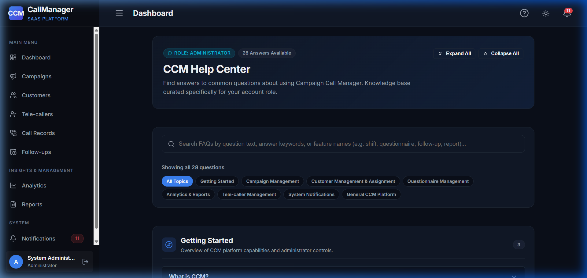

# CCM — Functional Capabilities & Feature Documentation

This document provides a comprehensive overview of all functional modules and user workflows implemented in **CCM (Campaign Call Manager)**, complete with interface screenshots.

---

## 1. Public SaaS Landing Page (`/`)

- **Hero Banner**: High-impact SaaS introduction communicating value propositions with primary CTAs: *"Sign In"*, *"Register as Tele-caller"*, *"Explore Capabilities"*, and *"Platform Tour"*.
- **Simulated Calling Console Mockup**: Interactive preview featuring a real-time ticking stopwatch timer, animated audio wave equalizer, outcome buttons, and interactive survey rating widget.
- **"Explore Capabilities"**: Smoothly scrolls to the core architecture section (`#features`).
- **Interactive Platform Tour (`#showcase`)**: 4-tab interactive walkthrough displaying Live Dialing & Stopwatch Logging, Dynamic Survey Engine, Smart Overdue Follow-up Tracker, and Audit-Grade Analytics.
- **Capabilities Matrix**: 6 comprehensive feature boxes detailing Campaign Management, Customer & Lead Directory, Live Calling Console, Dynamic Questionnaires, Follow-up Tracking, and Analytics & Report Center.
- **Operational Workflow Steps (`#how-it-works`)**: Visual 3-step walkthrough: *1. Configure & Ingest* ➔ *2. Dial, Time & Log* ➔ *3. Analyze & Export*.
- **Role Breakdown (`#roles`)**: Dedicated cards for System Administrator (ADMIN) and Tele-caller Agent (TELE_CALLER).
- **FAQ Accordion (`#faq`)**: Collapsible interactive accordion answering common platform and operational questions.
- **Theme Switcher**: Instant light/dark mode toggling, persisted via `localStorage`.

---

## 2. Role-Selection & Authentication (`/login/`)

- **Interactive Role Choice**: "Who are you?" portal with dedicated cards for **Administrator** and **Tele-caller**.
- **Role-Aware Forms**: Switches cleanly between role cards and credential inputs without full-page reloads.
- **Strict Server Validation**: Prevents credential crossover attacks (e.g. attempting to log into Administrator portal with Tele-caller credentials).
- **Password Visibility**: Eye icon toggle to reveal/hide password input.
- **Remember Me**: Configures session expiry (browser session vs persistent session).
- **Navigation Controls**: Clean `← Back to Home` and `← Change Role` buttons.
- **Tele-caller Onboarding Link**: Integrated callout linking directly to the registration page.

---

## 2.1. Tele-caller Self-Registration (`/register/`)

- **Dedicated Onboarding Portal**: Split-screen responsive interface tailored for prospective tele-callers.
- **Strict Role Pinning**: Automatically and securely assigns `role='TELE_CALLER'` to prevent privilege escalation.
- **Robust Field Validation**: Server-side checks for unique username, regex character rules, required names, valid unique email, phone number, password confirmation, and terms acceptance.
- **Dual Notification Dispatch**:
  - Automatically dispatches a *Welcome to CCM!* in-app notification to the newly registered agent.
  - Automatically alerts all active Administrators with an in-app notification: *New Tele-caller Registered*.
- **Instant Workspace Access**: Automatically logs in newly registered users and redirects them directly to their dedicated tele-caller workspace dashboard (`/dashboard/`).

---

## 3. Administrator Dashboard (`/dashboard/`)

- **Real-Time KPI Cards**:
  - Total & Active Campaigns
  - Total Customer Directory Count
  - Calls Completed vs Calls Pending
  - Follow-ups Due & Overdue
- **Active Campaign Progress Tracker**: Visual progress bars showing target call completion percentages (capped at 100%).
- **Quick Action Bar**: Fast shortcuts to *Create Campaign*, *Import Leads*, *Assign Customers*, *Analytics*, and *Reports*.

---

## 4. Tele-caller Personal Workspace (`/dashboard/`)

- **Personal Metrics**: Calls completed today, pending leads in queue, and follow-ups due today.
- **Next in Queue / Immediate Tasks**: Directly launches the Live Call Console for the agent's next assigned customer.
- **Assigned Campaigns**: View-only cards for active initiatives assigned to the tele-caller.

---

## 5. Campaign Management (`/campaigns/`)

- **Full Campaign CRUD**: Create, edit, toggle active/paused status, and delete campaigns.
- **Fields**: Name, description, campaign type, start date, end date, and target call volume.
- **Detailed Campaign Overview**: Real-time progress, enrolled customers list, assigned tele-callers, and call history.

---

## 6. Dynamic Questionnaire Builder (`/questionnaires/<campaign_id>/builder/`)

- **Campaign-Linked Questionnaires**: Attach bespoke surveys to specific campaigns.
- **5 Supported Question Types**:
  1. Single Choice (Radio)
  2. Multiple Choice (Checkboxes)
  3. Rating Scale (1 to 5 numeric stars)
  4. Open Ended (Text response)
  5. Yes / No (Binary option)
- **Live Preview Mode**: Verifies the exact survey layout agents see in the live call console.

---

## 7. Customer Directory & Bulk Import (`/customers/`)

- **Search, Filtering & Activity Views**: Instant search across customer name, phone, WhatsApp number, email, and company, with campaign, assignment status, and activity status filters (`Active` vs `Archived`).
- **Omnichannel Contact Details & Direct WhatsApp Integration**:
  - Full support for optional `whatsapp_number` with validation (minimum 7 digits).
  - Direct WhatsApp chat link (`https://wa.me/...`) rendered alongside contact numbers.
  - Persistent customer profile `notes` card providing background context for agents before placing calls.
- **Historical Data Safety & Archive Lifecycle**:
  - Deleting a customer with existing historical records (calls, follow-ups, or campaign enrollments) safely deactivates and archives them (`is_active = False`) rather than executing a destructive cascade delete.
  - Permanent deletion is reserved strictly for test leads with zero historical activity.
  - Single-click Reactivate/Restore action allows administrators to restore archived customer profiles.
  - Inactive customers are automatically excluded from new campaign assignments.
- **CSV & Excel Import Engine**:
  - Ingests `.csv` and modern `.xlsx` spreadsheet files with complete support for `name`, `phone`, `whatsapp_number`, `email`, `company`, `address`, `city`, `state`, and `notes`.
  - **Dual-Encoding Handling**: Supports both `utf-8-sig` and `latin-1` (Windows ANSI) automatically, eliminating `UnicodeDecodeError` exceptions on Excel-saved CSV files.
  - **Numeric Phone & WhatsApp Normalization**: Automatically normalizes Excel float values (e.g. `9876543210.0`) to clean integer phone strings (`9876543210`).
  - Validates missing names, phone formats, WhatsApp formats, and duplicate phone numbers within the file and against the existing database.
  - Interactive pre-import review table highlighting valid vs invalid rows.
  - Automatic enrollment into selected target campaigns.
- **Lead Assignment Engine (`/customers/assign/`)**:
  - Assign unassigned active leads to specific tele-callers individually or in bulk.
  - Excludes inactive/archived leads from assignment.
  - Prevents double-assignment.

| Bulk Ingestion & Validation Preview | Lead Assignment to Tele-callers |
| :---: | :---: |
|  |  |

---

## 8. Live Call Console (`/calls/record/<assignment_id>/`)

- **Tele-caller Calling Interface**:
  - Customer contact details, phone number, optional WhatsApp number, persistent customer profile notes, and complete history of previous calls.
  - Live stopwatch timer tracking call duration in seconds.
  - Outcome selector: `Completed`, `No Answer`, `Unreachable`, `Busy`, `Follow-up Required`.
- **Dynamic Survey Injection**: When marked `Completed`, questions from the campaign's questionnaire render dynamically for response logging.
- **Instant Callback Scheduling**: Easily schedule follow-up date and time if callback is requested.
- **Automated Milestone Trigger**: Automatically detects when a campaign reaches the 70% completed calls milestone and notifies administrators without duplicate alert spam.
- **Post-Call Confirmation (`/calls/record/success/<call_id>/`)**: Direct buttons to proceed to the next customer in queue or return to the dashboard.

---

## 9. Follow-up & Callback Management (`/followups/`)

- **Zero-Side-Scroll Data Table**: Engineered with smart truncation (`.cell-truncate`), hover tooltips, and consolidated call information to display seamlessly on 1080p, 1366x768, and 1280x800 screens without horizontal scrolling.
- **Contextual Actions Dropdown**: Polished action menu opening directly below the trigger button within screen boundaries.
- **Automated Overdue Detection**: Background and on-demand detection converting pending follow-ups to `Overdue` once the scheduled date/time passes.
- **Automated In-App Notification Lifecycle**:
  - Creates follow-up reminders upon call completion.
  - Automatically marks unread follow-up notifications as read when the follow-up task is marked completed or cancelled.
- **Task Management**:
  - **Mark Complete**: Mark follow-up reminders as completed once handled. Re-completion of already completed tasks is strictly prevented.
  - **Reschedule Callback**: Overdue or pending callbacks can be rescheduled directly via the UI modal with an updated date/time.
  - **Cancel Follow-up**: Cancel unnecessary reminders with state transition validation.
- **Data Isolation**: Tele-callers only see their own scheduled callbacks; administrators have organization-wide visibility.

---

## 10. Call Records & Activity Log (`/calls/records/`)

- **Organization-Wide & Agent Logs**: Complete log of all placed calls, outcomes, durations, and timestamps.
- **Outcome Status Indicators**: Color-coded badges for quick identification of conversion and callback requirements.

---

## 11. Tele-caller Workforce Directory (`/telecallers/`)

- **Team Oversight**: Administrator portal listing all onboarded tele-callers, active status, call totals, and performance indicators.
- **Secure Password Reset**: Dedicated modal triggering cryptographic HMAC token resets without ever transmitting plain-text passwords.

---

## 12. Analytics Engine & Report Center (`/analytics/` & `/reports/`)

- **Centralized Engine (`analytics/engine.py`)**:
  - Unified mathematical calculations for core KPIs: Total Calls, Completed Calls, Conversion Rate, and **Avg Call Duration** (formatted in mm:ss).
  - Global date filters (`Today`, `Last 7 Days`, `Last 30 Days`, `This Month`, `Last Month`, `Custom`).
- **Interactive Visualizations**:
  - Call Outcome distribution chart (Chart.js donut).
  - Activity over time trend line (Chart.js multi-line).

- **Report Center**:
  - 5 customizable reports with real-time pre-export record count previews.
  - **PDF Export Engine**: Built with ReportLab, featuring corporate headers, metadata summaries, and alternating table rows.
  - **Excel Export Engine**: Built with `openpyxl`, featuring dark headers, bold metrics, and auto-adjusted column widths.

---

## 13. Role-Based FAQ & Help Center (`/help/`)

- **Subtle Header Entry Point**: Accessible via a discrete `?` Help icon button in the authenticated top navigation bar (`#helpBtn`), providing instant assistance without cluttering the sidebar.
- **Strict Server-Side Role Segregation**: FAQ categories and questions are filtered on the backend (`get_faqs_for_user`), ensuring tele-callers cannot inspect or receive Admin operational instructions (such as campaign creation, lead shifting, workforce management, or report exports).
- **Admin Knowledge Base Categories**:
  - *Getting Started*: Overview of CCM capabilities and administrator controls.
  - *Campaign Management*: Creating, editing, tracking progress percentages, and questionnaire management.
  - *Customer Management*: CSV/Excel importing, lead assignment, explanation of why already-assigned customers are excluded from new assignment lists, workload shifting, and historical call preservation.
  - *Questionnaire Management*: Creating questions, 5 supported question types, required questions validation, and availability in live call console.
  - *Analytics & Reports*: Database-derived KPIs, campaign progress capping at 100%, tele-caller performance, and PDF/Excel report exports.
  - *Tele-caller Management*: Roster administration, assigning workload, and agent permissions.
  - *Notifications*: System alerts (70% campaign milestone, 7-day agent inactivity), and read management.
- **Tele-caller Knowledge Base Categories**:
  - *Getting Started*: Tele-caller workspace overview, assigned workload, and daily workflow.
  - *Customer Leads & Campaigns*: Lead visibility, why unassigned leads are not visible, and workload shift handling.
  - *Call Console*: Starting calls, outcome disposition statuses, notes, and call stopwatch.
  - *Questionnaire*: Locating call scripts, answering 5 question types, handling required questions, and response saving.
  - *Follow-ups*: Scheduling, managing overdue callbacks, rescheduling, and resolution.
  - *Call History*: Reviewing personal calls, privacy boundaries, and customer ownership isolation.
  - *Notifications*: In-app assignment alerts and marking notifications as read.
- **Shared General Section**: Dark/Light theme toggling, browser compatibility, and secure logout.
- **Client-Side Live Instant Search**: Real-time filtering across question text and answer text with dynamic counter, category pill filters, and accessible empty state (`"No matching FAQs found"`).
- **Contextual Help Links**: Non-intrusive links on high-impact pages (Customer Assignment, Call Console, Follow-ups) directing users straight to relevant Help Center sections.
- **Accessible & Responsive Accordion**: Keyboard-accessible buttons, ARIA state attributes (`aria-expanded`), expand/collapse all controls, and full mobile/tablet responsiveness with CSS custom property theming.

