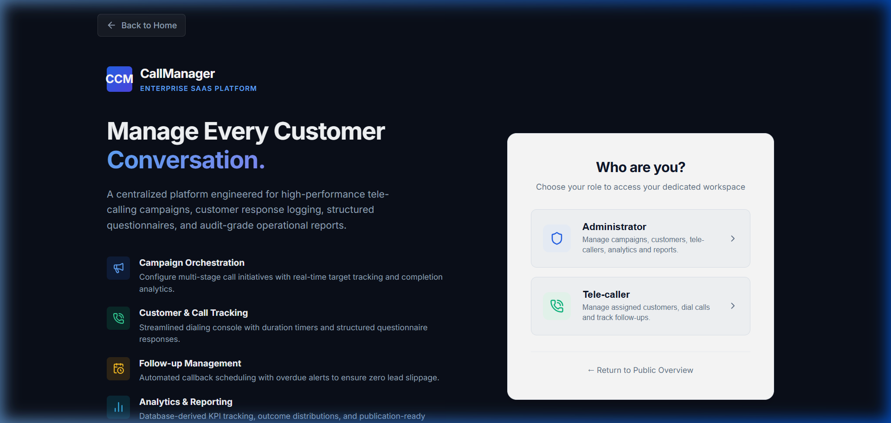
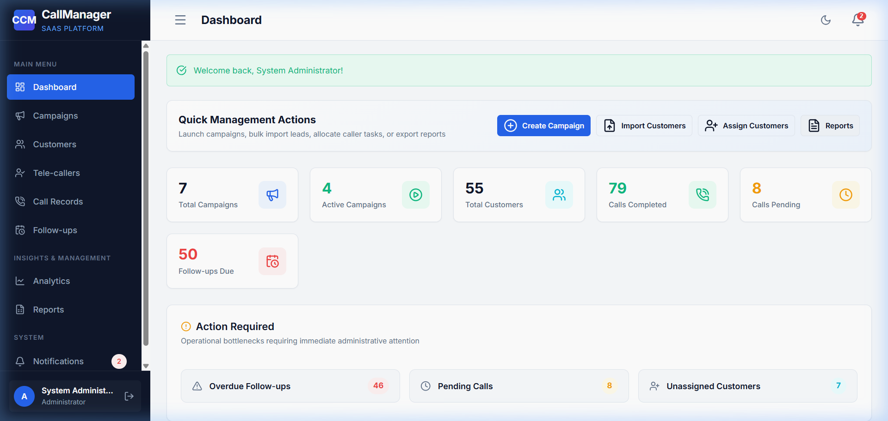
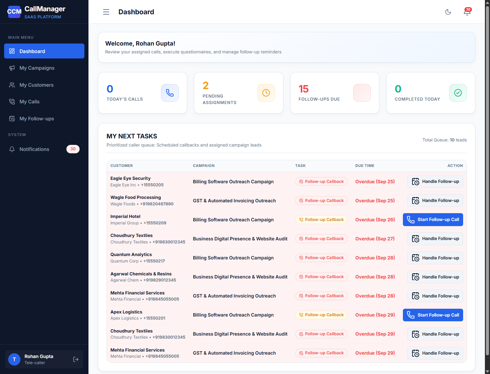

# CCM — Role-Based Access Control (RBAC) & Data Isolation

This document defines the Role-Based Access Control (RBAC) architecture, permissions matrix, view decorators, and object-level data isolation rules in **CCM (Campaign Call Manager)**.

---

## 1. Role Definitions

CCM defines two mutually exclusive roles on the custom `User` model:

1. **`ADMIN` (Administrator)**:
   - Executive and operational manager.
   - Has full oversight across all campaigns, customers, tele-callers, questionnaires, analytics, and operational reports.
2. **`TELE_CALLER` (Tele-caller)**:
   - Front-line execution agent.
   - Has access only to campaigns and customers explicitly assigned to them.
   - Records live call interactions, logs questionnaire responses, and manages scheduled follow-up callbacks.



### Multi-Portal Separation:

| Administrator Portal View | Tele-caller Workspace View |
| :---: | :---: |
|  |  |
| *Full organization oversight, analytics, and admin tools* | *Assigned leads, personal queue, and callbacks* |

---

## 2. Comprehensive Permissions Matrix

| Feature / Module | Administrator (`ADMIN`) | Tele-caller (`TELE_CALLER`) | Enforcement Mechanism |
| :--- | :---: | :---: | :--- |
| **Public Landing Page** (`/`) | Full Access | Full Access | Public route (`home_view`) |
| **Health Check** (`/health/`) | Full Access | Full Access | Public JSON endpoint |
| **Dashboard** (`/dashboard/`) | Admin Overview | Personal Workspace | Role dispatch in `dashboard` view |
| **Campaigns: List** (`/campaigns/`) | All Campaigns | Assigned Campaigns Only | Queryset filtering on user assignments |
| **Campaigns: Create** (`/campaigns/create/`) | ✅ Allowed | ❌ **HTTP 403 Forbidden** | `@admin_required` decorator |
| **Campaigns: Detail** (`/campaigns/<id>/`) | All Campaigns | Assigned Campaigns Only | IDOR check (`is_assigned` verification) |
| **Campaigns: Edit / Delete / Toggle** | ✅ Allowed | ❌ **HTTP 403 Forbidden** | `@admin_required` decorator |
| **Questionnaire Builder** | ✅ Allowed | ❌ **HTTP 403 Forbidden** | `@admin_required` decorator |
| **Customers: Directory** (`/customers/`) | Organization-wide | Assigned Customers Only | Queryset filtering on user assignments |
| **Customers: Create / Edit / Archive / Delete** | ✅ Allowed | ❌ **HTTP 403 Forbidden** | `@admin_required` decorator |
| **Customers: Restore Archived** (`/customers/<id>/restore/`) | ✅ Allowed | ❌ **HTTP 403 Forbidden** | `@admin_required` decorator |
| **Customers: CSV/XLSX Import & Assign** | ✅ Allowed | ❌ **HTTP 403 Forbidden** | `@admin_required` decorator |
| **Customers: Detail** (`/customers/<id>/`) | All Customers | Assigned Customers Only | IDOR check (`is_assigned` verification) |
| **Tele-caller Self-Registration** (`/register/`) | Public / All | Public / All | Hardcoded `role='TELE_CALLER'` in Python |
| **Tele-caller Roster & Detail** | ✅ Allowed | ❌ **HTTP 403 Forbidden** | `@admin_required` decorator |
| **Tele-caller Password Reset** | ✅ Allowed | ❌ **HTTP 403 Forbidden** | `@admin_required` decorator |
| **Live Call Console** (`/calls/record/<id>/`) | ❌ **HTTP 403 Forbidden** | Assigned Workload Only | `@telecaller_required` & assignment check |
| **Call Records: History** (`/calls/`) | Organization-wide | Own Call Logs Only | Queryset filtered by `telecaller=request.user` |
| **Follow-ups: List** (`/followups/`) | Organization-wide | Own Follow-ups Only | Queryset filtered by `assigned_to=request.user` |
| **Follow-ups: Complete / Cancel / Reschedule** | Organization-wide | Own Follow-ups Only | Ownership check on `followup.assigned_to` & status validation |
| **Analytics Dashboard** (`/analytics/`) | ✅ Allowed | ❌ **HTTP 403 Forbidden** | `@admin_required` decorator |
| **Chart API** (`/analytics/api/chart-data/`) | ✅ Allowed | ❌ **HTTP 403 Forbidden** | `@admin_required` decorator |
| **Report Center** (`/reports/`) | ✅ Allowed | ❌ **HTTP 403 Forbidden** | `@admin_required` decorator |
| **PDF & Excel Exports** | ✅ Allowed | ❌ **HTTP 403 Forbidden** | `@admin_required` decorator |
| **Notifications** (`/notifications/`) | Own Notifications | Own Notifications | Queryset filtered by `recipient=request.user` |
| **Help Center & FAQs** (`/help/`) | Admin FAQs + General | Tele-caller FAQs + General | Server-side role payload filtering (`get_faqs_for_user`) & `@login_required` |

---

## 3. Server-Side Protection Mechanisms

### A. The `@admin_required` Decorator
Located in [`accounts/decorators.py`](file:///f:/CCM/accounts/decorators.py):
```python
def admin_required(view_func):
    @wraps(view_func)
    def _wrapped_view_func(request, *args, **kwargs):
        if not request.user.is_authenticated:
            return redirect('login')
        if not request.user.is_admin_user:
            raise PermissionDenied("Only administrators can access this section.")
        return view_func(request, *args, **kwargs)
    return _wrapped_view_func
```
- If an unauthenticated user accesses an admin endpoint, they are redirected to `/login/`.
- If an authenticated `TELE_CALLER` accesses an admin endpoint, Django raises `PermissionDenied`, returning **HTTP 403 Forbidden** via [`templates/errors/403.html`](file:///f:/CCM/templates/errors/403.html).

### B. IDOR & Object-Level Assignment Protection
Even if an agent guesses or manipulates a primary key in the URL:
1. **Customer Detail (`/customers/<pk>/`)**:
   ```python
   if request.user.is_telecaller_user:
       is_assigned = CampaignCustomer.objects.filter(
           customer=customer, assigned_telecaller=request.user
       ).exists()
       if not is_assigned:
           messages.error(request, "You do not have access to this customer.")
           return redirect('customer_list')
   ```
2. **Call Recording (`/calls/record/<assignment_id>/`)**:
   ```python
   if request.user.is_telecaller_user and assignment.assigned_telecaller != request.user:
       messages.error(request, "Access denied: This customer is not assigned to you.")
       return redirect('customer_list')
   ```
3. **Follow-up Actions (`/followups/<pk>/complete/`)**:
   ```python
   if request.user.is_telecaller_user and followup.assigned_to != request.user:
       messages.error(request, "Permission denied.")
       return redirect('followup_list')
   ```

---

## 4. Role-Based Sidebar Navigation

Navigation items are rendered conditionally based on `request.user.is_admin_user` in [`templates/components/sidebar.html`](file:///f:/CCM/templates/components/sidebar.html):

- **Admin Sidebar**:
  - `Dashboard`
  - `Campaigns`
  - `Customers`
  - `Tele-callers`
  - `Call Records`
  - `Follow-ups`
  - **Insights & Management** section: `Analytics`, `Reports`
  - `Notifications`
- **Tele-caller Sidebar**:
  - `Dashboard`
  - `My Campaigns`
  - `My Customers`
  - `My Calls`
  - `My Follow-ups`
  - `Notifications`

*Note: Tele-callers never see `Tele-callers`, `Analytics`, `Reports`, or the `Insights & Management` section.*

---

## 5. Role-Based Knowledge Base & Help Center Isolation

The Help Center (`/help/`) enforces strict server-side content boundaries rather than cosmetic frontend hiding:

- **Enforcement Function (`accounts/faq_data.py`)**:
  ```python
  def get_faqs_for_user(user):
      if not user or not user.is_authenticated:
          return []
      if getattr(user, 'is_admin_user', False) or user.role == 'ADMIN':
          return ADMIN_FAQ_CATEGORIES + [GENERAL_FAQ_CATEGORY]
      elif getattr(user, 'is_telecaller_user', False) or user.role == 'TELE_CALLER':
          return TELECALLER_FAQ_CATEGORIES + [GENERAL_FAQ_CATEGORY]
      return [GENERAL_FAQ_CATEGORY]
  ```
- **Security Guarantee**:
  - Tele-caller HTTP responses contain zero Admin operational categories (e.g. Campaign creation, customer shifting, tele-caller roster management, analytics, report exports).
  - Both roles have access only to verified operational workflows relevant to their designated privileges.
